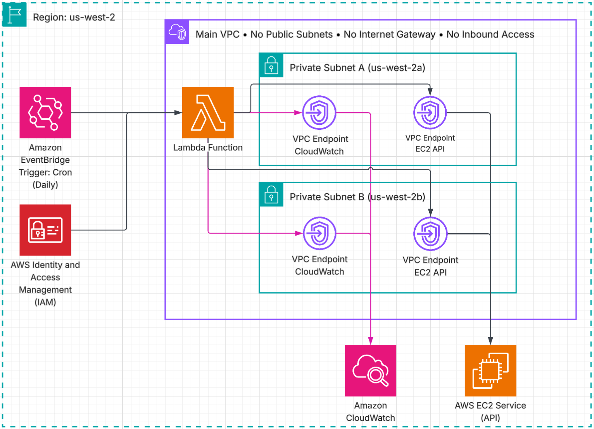

# Clean EC2 Snapshots

This repository contains the infrastructure and code for an automated AWS Lambda function designed to clean up old EC2 snapshots. It is built to be lightweight, secure, and robust.

---

## Architecture Diagram



---

## Architecture & Design Decisions

### Infrastructure as Code (IaC): OpenTofu

We use **OpenTofu** as our IaC tool. OpenTofu is the community-maintained, Apache 2.0-licensed fork of Terraform, governed by the Linux Foundation.

### Compute & Trigger: AWS Lambda & EventBridge

The core logic runs on a Python 3.12 AWS Lambda function. Lambda is ideal for this lightweight, periodic administrative task — there is no server to manage and cost is effectively zero at this invocation frequency.

To schedule the task, we use an **Amazon EventBridge Rule** with a `cron()` expression. EventBridge is the modern successor to the legacy CloudWatch Events service and supports the same familiar cron syntax. This gives us the cron-style scheduling behavior without managing any infrastructure to run it on.

### Observability

The Lambda function uses standard Python `logging` to write to **Amazon CloudWatch Logs**. AWS X-Ray was evaluated and deemed unnecessary — this is a standalone asynchronous script with no downstream microservice calls or fan-out, so distributed tracing adds cost without value.

### Safety Measures

The Lambda script guards against deleting snapshots that are genuinely in use before attempting any deletion:

1. **AMI-backed snapshots:** Queries `describe_images(Owners=['self'])` to find all account-owned AMIs. Any snapshot referenced in an AMI's block device mapping is skipped — AWS enforces this too with `InvalidSnapshot.InUse`, but detecting it pre-flight avoids unnecessary API errors and provides a clear log entry.
2. **API-level fallback:** If an `InvalidSnapshot.InUse` error is returned during deletion (e.g., a race condition), it is caught and logged rather than treated as a failure.

A snapshot from which a volume was previously created is **not** considered in use. Once a volume is created from a snapshot, it is a full independent copy — deleting the snapshot has no effect on the volume. Only AMI-backed snapshots represent a true dependency.

In-use snapshots older than one year are logged at `INFO` rather than `WARNING`. On a daily schedule, warning on the same snapshot every day creates alert fatigue without conveying new information.

### Operational Context: Origin of Snapshots

In a mature IaC environment, manual snapshot creation is rare. The primary sources of accumulated old snapshots are:

1. **Orphaned AMI Backups:** CI/CD pipelines (e.g., Packer, Image Builder) baking new AMIs for autoscaling groups create underlying snapshots. When old AMIs are retired, the snapshot is often left behind.
2. **Pre-Deployment Safety Snapshots:** Taken automatically before risky stateful deployments (e.g., database migrations) where the pipeline lacks a post-success cleanup step.
3. **Misconfigured Backup Policies:** AWS Backup or Data Lifecycle Manager (DLM) policies where retention was removed or misconfigured.

---

## Local Unit Testing

To ensure correctness without incurring AWS costs or risking live environments, this project includes a unit test suite using `pytest` and `moto`. `moto` intercepts Boto3 calls and mocks the AWS EC2 API entirely in memory. This allows us to simulate time passing by mocking snapshot creation dates, proving the 1-year deletion logic is correct.

```bash
# 1. Create and activate a virtual environment
python3 -m venv venv
source venv/bin/activate  # Windows: venv\Scripts\activate

# 2. Install test dependencies
pip install -r requirements-test.txt

# 3. Run the test suite
pytest tests/ -v
```

The suite covers six cases: deleting an old unattached snapshot; skipping a recent snapshot; deleting an old snapshot whose only relationship is a derived volume (the volume is independent); skipping an AMI-backed snapshot; handling an `InvalidSnapshot.InUse` error returned by the API; and logging errors on any other unexpected `ClientError`.

---

## Deployment & Execution

### 1. Manual Execution

To deploy the infrastructure manually, ensure you have the AWS CLI configured and OpenTofu installed (`tofu` >= 1.6.0).

```bash
# 1. Initialize the OpenTofu workspace
tofu init

# 2. Review the execution plan
tofu plan -var-file="tf/environments/dev.tfvars"

# 3. Apply the changes
tofu apply -var-file="tf/environments/dev.tfvars"
```

### 2. CI/CD Deployment (GitLab CI)

This project is structured to integrate into a standard GitLab CI pipeline:

- **Stage 1 (Lint/Test):** Run `tflint` on the OpenTofu code and `pytest` on the Python tests. Optionally run `black --check src/` for formatting.
- **Stage 2 (Plan):** Execute `tofu plan -var-file="tf/environments/dev.tfvars" -out=tfplan` and save `tfplan` as a pipeline artifact.
- **Stage 3 (Apply):** Run `tofu apply tfplan` using the artifact from Stage 2. This ensures what was reviewed in the plan is exactly what gets applied. Non-production environments can auto-apply; production should require a manual approval gate.

AWS credentials (`AWS_ACCESS_KEY_ID`, `AWS_SECRET_ACCESS_KEY`) are injected as masked CI/CD variables. Any `variables.tf` value can be overridden at pipeline time using the `TF_VAR_` prefix without modifying files (e.g., `TF_VAR_aws_region=us-west-2`).

### 3. Deploying the Lambda Code

Packaging and deployment of the Lambda code are handled entirely by OpenTofu. The `archive_file` data source in `tf/main.tf` automatically zips the `src/` directory at plan time. When `tofu apply` runs, OpenTofu compares the `source_code_hash`; if the Python source has changed, it builds a new zip and updates the Lambda function in place. No external build scripts, Docker containers, or manual upload steps are required.

---

## Configuration Details

### VPC Configuration

The Lambda function attaches to an existing "Main" VPC and private subnets — this module does not create them. The VPC and subnet IDs are supplied via `tf/environments/dev.tfvars` and passed in as variables.

- **Subnets:** Configured via `var.subnet_ids` in `vpc_config`. One or more private subnet IDs can be supplied.
- **Security Groups:** A dedicated security group (`lambda_sg`) is provisioned by this module, allowing only outbound HTTPS (port 443).
- **VPC Endpoints:** Because the Lambda runs in a private subnet with no Internet Gateway or NAT Gateway, VPC Interface Endpoints are provisioned in `tf/network.tf` for every AWS service the function contacts:
  - `com.amazonaws.us-west-2.ec2` — for all snapshot and AMI API calls
  - `com.amazonaws.us-west-2.logs` — for CloudWatch Logs output

  Both endpoints use `private_dns_enabled = true`, so the AWS SDK resolves the standard service hostnames to the VPC endpoint ENIs automatically — no code changes required. Both share a single security group that restricts ingress to port 443 from the Lambda security group only.

### IAM Role & Permissions

The IAM role follows the **Principle of Least Privilege**:

- **Trust Policy:** Allows only the `lambda.amazonaws.com` service to assume the role.
- **VPC Execution Policy:** The AWS-managed `AWSLambdaVPCAccessExecutionRole` policy allows the Lambda to create and manage Elastic Network Interfaces (ENIs) in the VPC subnets.
- **Custom EC2 Permissions:** A scoped inline policy granting only the required actions:
  - `ec2:DescribeSnapshots`, `ec2:DeleteSnapshot` — core operations
  - `ec2:DescribeImages` — required to detect AMI-backed snapshots before deletion

### Assumptions Made

The following assumptions were made during implementation:

- **AWS Region:** `us-west-2`, as configured in `tf/environments/dev.tfvars`. Changeable per environment.
- **Existing VPC and Subnets:** This module attaches to pre-existing infrastructure. The `vpc_id` and `subnet_ids` in `dev.tfvars` must be updated to match the actual IDs in the target AWS account before applying.
- **Single Account:** The function operates within a single AWS account. Cross-account snapshot cleanup would require additional IAM trust relationships.
- **Python Runtime:** Python 3.12 is available in the target AWS Lambda runtime. The function has no external dependencies beyond `boto3`, which is pre-installed in the Lambda execution environment.
- **Remote State Backend:** This configuration does not include a `backend` block. For any shared or production use, a remote backend should be configured — for example, an S3 bucket with DynamoDB state locking:
  ```hcl
  terraform {
    backend "s3" {
      bucket         = "my-tofu-state-bucket"
      key            = "clean-ec2-snapshots/dev/terraform.tfstate"
      region         = "us-west-2"
      dynamodb_table = "tofu-state-lock"
      encrypt        = true
    }
  }
  ```
  Without a remote backend, state is stored locally and is not safe for shared or automated pipelines.
- **In-Use Definition:** A snapshot is considered in use only if it backs a registered AMI. Snapshots from which volumes were previously created are treated as orphaned and eligible for deletion — the derived volume is a full independent copy and is unaffected.
- **EventBridge Retry Behavior:** EventBridge scheduled rules invoke Lambda once per schedule. If the Lambda errors, there is no automatic retry. A missed daily run means the cleanup will next occur the following day.

---

## Monitoring Execution

The Lambda function's execution is monitored via **Amazon CloudWatch**:

- **Logs:** A dedicated Log Group (`/aws/lambda/CleanEC2Snapshots`) with a 14-day retention policy is created by OpenTofu. Each invocation logs the cutoff date, the number of snapshots evaluated, deleted, and skipped, plus any errors.
- **Metrics:** CloudWatch automatically tracks Lambda metrics: `Invocations`, `Duration`, `Errors`, and `Throttles`. A CloudWatch Alarm on the `Errors` metric can alert the team if the function fails during a scheduled run.
